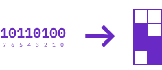
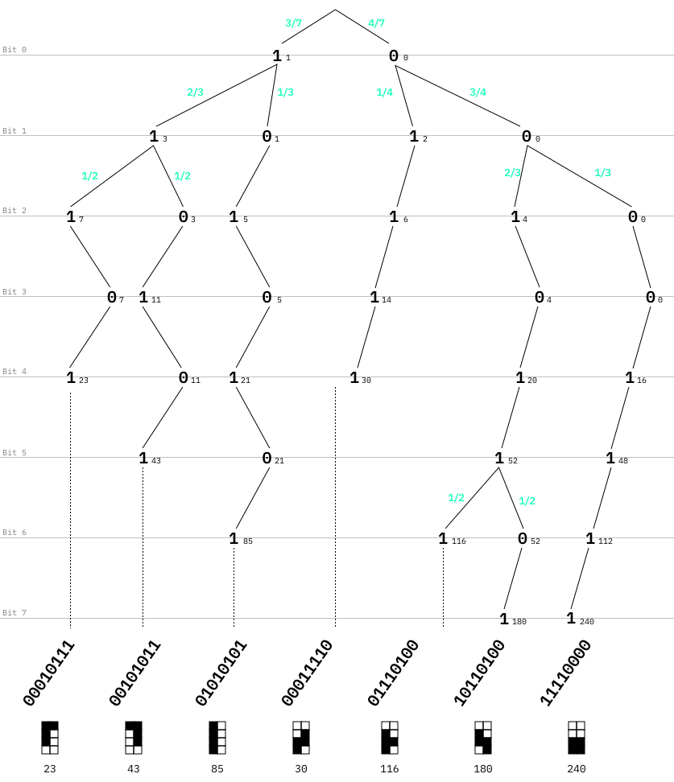

# Tetris Block Generator Code

Each Tetris block is generated through a quantum circuit. To achieve this, we translated the Tetris blocks into a grid, which we then set up with binary values. The grid looks like this:


This would mean, that a binary value of `10110100` (binaries are read from right to left) would generate a "S" shaped block. 



This results in a binary conversion as displayed in the table below. The "decimal" value describes the binary number to a base of `10`. This becomes helpful in the quantum simulation.

|binary  |decimal|Tetris block|
|--------|-------|------------|
|00010111|23     |Reverse L   |
|00011110|30     |Z           |
|00101011|43     |L           |
|01010101|85     |Long        |
|01110100|116    |T           |
|10110100|180    |S           |
|11110000|240    |Square      |

Knowing this, we then can bit by bit generate the Tetris blocks, starting from the first bit (position `0`). The decision tree is displayed below. The green numbers display the probability of each decision, which is then translated into the angle in the qubit.



This tree is represented in the code below, using [Qiskit](https://qiskit.org).

```python
...

# Example code for one register digit

# If register is 00000110 = 6, then rotate cubit by π 
qc.rx(np.pi, 0).c_if(cr, 6)

# If register is 00000100 = 4, then don't rotate cubit 
# (could have been left out, but for consistency purposes we left it in the code) 
qc.rx(0, 0).c_if(cr, 4)

# If register is 00000000 = 0
qc.rx(0, 0).c_if(cr, 0)

# Other register combinations should not appear to generate our 7 TETRIS blocks

# Measure and store at the new 4th position 
qc.measure(0,3)

# Reset to use the cubit for the next calculation
qc.reset(0)

...
```